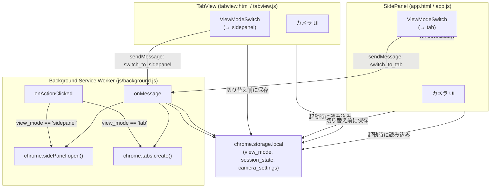
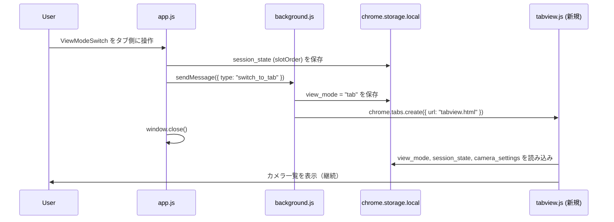
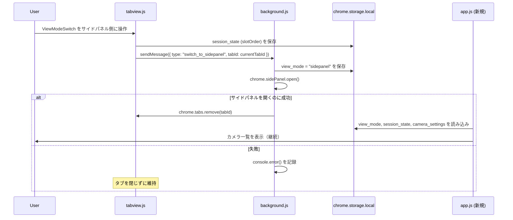
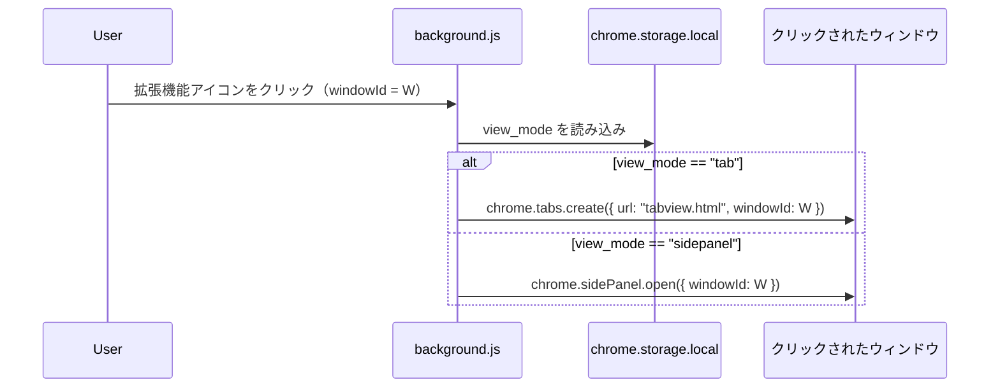
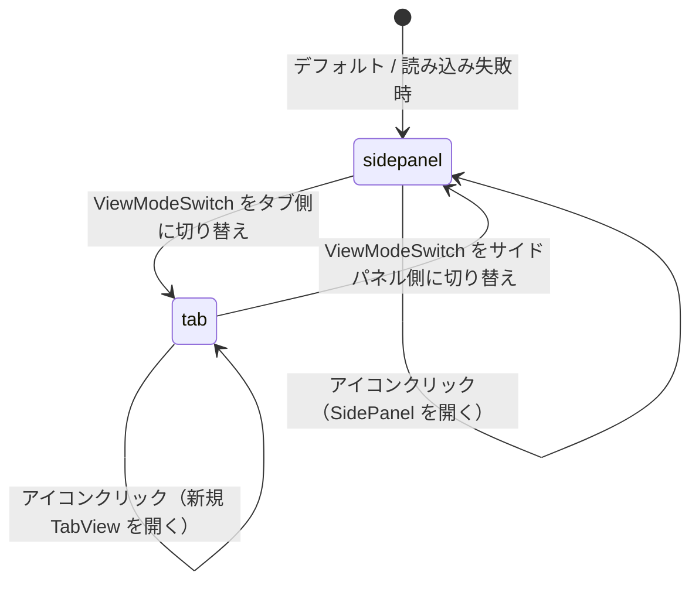

# Design Document — tab-view-mode

## Overview

サイドパネル表示とタブ全体表示をワンタップで切り替える「表示位置切り替え」機能の設計書。

ユーザーは `projects/app/app.html`（サイドパネル）のヘッダーに配置された **ViewModeSwitch**（M3 スタイルのトグルスイッチ）を操作することで、OmniView-Solo の表示先を `sidepanel` と `tab` の間で切り替えられる。カメラの接続状態（deviceId リスト・各設定）は `chrome.storage.local` を介して両モード間で引き継がれる。

### 設計上の主な決定事項

| 決定事項 | 選択 | 理由 |
|---|---|---|
| `chrome.sidePanel.open()` の呼び出し元 | `background.js` のみ | サイドパネルページ・タブページから直接呼ぶことは Chrome API 上禁止されているため |
| サイドパネルを「閉じる」方法 | `window.close()` を app.js から呼び出す | サービスワーカー経由でサイドパネルを閉じる API は MV3 に存在しない |
| タブ間通信 | `chrome.runtime.sendMessage` / `chrome.runtime.onMessage` | background.js を中継することで任意のページ・SW 間で通信できる |
| タブモードのアイコンクリック時の動作 | クリックしたウィンドウに常に新規 TabView を開く | ウィンドウをまたいで既存タブを探す UX より「そのウィンドウで即開く」方が直感的 |
| カメラ状態の引き継ぎ | Storage への事前書き込み + 遷移後ページが起動時に読み込む | Transferable なオブジェクトを直接渡す手段がない |
| `setPanelBehavior` の扱い | タブモード時は `openPanelOnActionClick: false` に変更する | `openPanelOnActionClick: true` は `chrome.action.onClicked` を上書きするため、タブモード時はアイコンクリックで自前処理が必要 |
| カメラ状態の保存キー | `active_camera_ids` = `session_state.slotOrder`、`camera_settings` = 既存キー | `camera.js` の既存 `saveSessionState`・`loadSessionState` 実装との整合性を保つ |

---

## Architecture



### 通信フロー：サイドパネル → タブ切り替え



### 通信フロー：タブ → サイドパネル切り替え



### 通信フロー：拡張機能アイコンクリック



---

## Components and Interfaces

### 1. ViewModeSwitch コンポーネント（新規: `js/viewModeSwitch.js`）

HTML/CSS/JS で実装するカスタム M3 トグルスイッチ。`app.html` と `tabview.html` の両方に埋め込まれる。

**HTML 構造:**

```html
<div class="view-mode-switch" role="switch" aria-checked="false" tabindex="0">
  <span class="vms-icon vms-icon--tab" aria-hidden="true">
    <!-- タブ全体アイコン (SVG or Material Symbol) -->
  </span>
  <div class="vms-track">
    <div class="vms-thumb"></div>
  </div>
  <span class="vms-icon vms-icon--sidepanel" aria-hidden="true">
    <!-- サイドパネルアイコン (SVG or Material Symbol) -->
  </span>
</div>
```

**状態と CSS クラス:**

| 状態 | クラス / 属性 |
|---|---|
| サイドパネルモード（右） | `aria-checked="true"`, `.vms-track--sidepanel` |
| タブモード（左） | `aria-checked="false"`, `.vms-track--tab` |
| トランジション中 | `.vms-track--animating`（100ms 後に除去） |

**JavaScript インターフェース:**

```js
// js/viewModeSwitch.js（app.js / tabview.js 両方から import）

/**
 * ViewModeSwitch を初期化する
 * @param {HTMLElement} element - .view-mode-switch 要素
 * @param {"sidepanel"|"tab"} initialMode - 初期表示モード
 * @param {function("sidepanel"|"tab"): void} onChange - モード変更時コールバック
 */
export function initViewModeSwitch(element, initialMode, onChange) { ... }

/**
 * スイッチの表示状態のみを更新する（副作用なし）
 * @param {HTMLElement} element
 * @param {"sidepanel"|"tab"} mode
 */
export function setViewModeSwitchState(element, mode) { ... }
```

---

### 2. storageManager モジュール（新規: `js/storageManager.js`）

`chrome.storage.local` の `view_mode` 読み書きをラップする純粋関数群。
カメラ状態（`session_state`・`camera_settings`）は既存の `camera.js` の
`saveSessionState` / `loadSessionState` / `loadCameraSettings` をそのまま利用する。

```js
// js/storageManager.js

/**
 * ViewMode を Storage から読み込む。読み込み失敗時・不正値時は "sidepanel" を返す。
 * @returns {Promise<"sidepanel"|"tab">}
 */
export async function getViewMode() { ... }

/**
 * ViewMode を Storage に保存する。
 * @param {"sidepanel"|"tab"} mode
 * @returns {Promise<void>}
 */
export async function setViewMode(mode) { ... }

/**
 * 生の Storage 値を ViewMode に変換する純粋関数（テスト用エクスポート）
 * @param {unknown} rawValue
 * @returns {"sidepanel"|"tab"}
 */
export function getViewModeWithDefault(rawValue) { ... }
```

> カメラ状態の保存・読み込みは `camera.js` の既存関数を使用するため、
> `saveCameraState` / `loadCameraState` は storageManager には含めない。

---

### 3. messageBus インターフェース

ページ ↔ Background SW 間のメッセージプロトコル定義。

```js
/**
 * @typedef {"switch_to_tab"|"switch_to_sidepanel"} MessageType
 */

/**
 * @typedef {Object} SwitchMessage
 * @property {MessageType} type
 * @property {number} [tabId] - switch_to_sidepanel 時に TabView 側が送る閉じるべきタブ ID
 */

// app.js / tabview.js から送信
chrome.runtime.sendMessage({ type: "switch_to_tab" });
chrome.runtime.sendMessage({ type: "switch_to_sidepanel", tabId: currentTabId });

// background.js で受信
chrome.runtime.onMessage.addListener((message, sender, sendResponse) => {
  if (message.type === "switch_to_tab") { ... }
  if (message.type === "switch_to_sidepanel") { ... }
});
```

---

### 4. background.js — 改修内容

既存の `background.js` は `setPanelBehavior({ openPanelOnActionClick: true })` のみ。
以下の改修を行う：

```js
// js/background.js（改修後）

// 起動時: view_mode を読み込み、setPanelBehavior を適切に設定する
// view_mode == "sidepanel" → openPanelOnActionClick: true（既存動作）
// view_mode == "tab"       → openPanelOnActionClick: false → onClicked で TabView を開く

chrome.runtime.onInstalled.addListener(() => syncPanelBehavior());
chrome.runtime.onStartup.addListener(() => syncPanelBehavior());

chrome.action.onClicked.addListener(async (tab) => {
  // view_mode == "sidepanel" のときは openPanelOnActionClick: true が
  // onClicked より優先されるため、ここに到達するのは tab モード時のみ
  await chrome.tabs.create({ url: chrome.runtime.getURL("tabview.html"), windowId: tab.windowId });
});

chrome.runtime.onMessage.addListener((message, sender, sendResponse) => {
  if (message.type === "switch_to_tab") {
    // Storage に view_mode = "tab" 保存 → setPanelBehavior(false) → TabView を開く
  }
  if (message.type === "switch_to_sidepanel") {
    // Storage に view_mode = "sidepanel" 保存 → setPanelBehavior(true)
    // → chrome.sidePanel.open() → 成功時 chrome.tabs.remove(tabId)
  }
});

/**
 * viewMode に基づいて setPanelBehavior を同期する
 * viewMode == "sidepanel" → openPanelOnActionClick: true
 * viewMode == "tab"       → openPanelOnActionClick: false
 */
async function syncPanelBehavior() { ... }

/**
 * テスト用純粋関数: ViewMode と windowId からアクションを決定する
 * @param {"sidepanel"|"tab"} viewMode
 * @param {number} windowId
 * @returns {{ type: "create_tab"|"open_sidepanel", windowId: number }}
 */
export function resolveIconClickAction(viewMode, windowId) { ... }
```

---

### 5. app.html / app.js — 改修内容

- `app.html` のヘッダー左側に `.view-mode-switch` 要素を追加する
- `app.js` 起動時に `getViewMode()` を呼び出し、ViewModeSwitch を初期化する
- ViewModeSwitch の `onChange("tab")` 時：
  1. `saveSessionState(this.slotOrder, this.activeSlotIndex)` を呼び出す（camera.js の既存関数）
  2. `chrome.runtime.sendMessage({ type: "switch_to_tab" })` を送信する
  3. `window.close()` でサイドパネルを閉じる

---

### 6. tabview.html / tabview.js（新規）

サイドパネルと同等の機能をタブ全体に表示する新規ページ。

- `app.html` と共通のカメラ UI コンポーネントを最大限再利用する
- 起動時に `getViewMode()`、`loadSessionState()`（camera.js）、`loadCameraSettings()`（camera.js）を読み込む
- ViewModeSwitch の初期状態は `"tab"`（左選択状態）
- ViewModeSwitch の `onChange("sidepanel")` 時：
  1. `saveSessionState(...)` を呼び出す
  2. `chrome.tabs.getCurrent()` で `currentTabId` を取得する
  3. `chrome.runtime.sendMessage({ type: "switch_to_sidepanel", tabId: currentTabId })` を送信する

---

## Data Models

### chrome.storage.local スキーマ（追加分）

```json
{
  "view_mode": "sidepanel",
  "session_state": {
    "slotOrder": ["deviceId_abc123", "deviceId_xyz789"],
    "activeSlotIndex": 0
  },
  "camera_settings": {
    "deviceId_abc123": {
      "defaultRole": "whiteboard",
      "customLabel": "会議室A正面ホワイトボード",
      "modes": {
        "whiteboard": {
          "points": [
            { "x": 10, "y": 10 },
            { "x": 200, "y": 10 },
            { "x": 200, "y": 150 },
            { "x": 10, "y": 150 }
          ]
        },
        "person": {}
      }
    }
  }
}
```

| キー | 型 | デフォルト | 説明 |
|---|---|---|---|
| `view_mode` | `"sidepanel" \| "tab"` | `"sidepanel"` | 現在の表示モード |
| `session_state.slotOrder` | `string[]` | `[]` | 現在アクティブな deviceId の順序付きリスト（既存キー） |
| `session_state.activeSlotIndex` | `number` | `0` | アクティブスロットのインデックス（既存キー） |
| `camera_settings` | `{ [deviceId]: CameraConfig }` | `{}` | 既存スキーマ。今回は参照のみ |

> `active_camera_ids` は使用しない。既存の `session_state.slotOrder` で代替する。

### ViewMode 型

```js
/** @typedef {"sidepanel"|"tab"} ViewMode */
```

### CameraConfig 型（既存・参照）

```js
/**
 * @typedef {Object} CameraConfig
 * @property {"whiteboard"|"person"} defaultRole - カメラの役割
 * @property {string} [customLabel] - ユーザー定義ラベル
 * @property {number} [zoom] - ズームレベル（1/2/4）
 * @property {boolean} [mediaSettingsFixed] - フォーカスロック状態
 * @property {{ person: Object, whiteboard: { points?: Array } }} modes
 */
```

### ViewMode の状態遷移



---

## Correctness Properties

### Property 1: 不正な ViewMode 値は "sidepanel" にフォールバックする

`getViewModeWithDefault(rawValue)` において、Storage から取得した値が `null`、`undefined`、空文字列、または `"sidepanel"` / `"tab"` 以外の任意の文字列である場合、*常に* `"sidepanel"` を返さなければならない。

**Validates: Requirements 1.5, 6.4**

---

### Property 2: カメラ状態は Storage 経由でモード間で引き継がれる

任意の `slotOrder`（長さ 0 以上）を持つ状態でモード切り替えを行ったとき、切り替え後のビューが Storage から読み込む `session_state.slotOrder` は、切り替え前のビューが `saveSessionState` で保存したリストと常に一致しなければならない。

**Validates: Requirements 3.1, 3.2**

---

### Property 3: モード切り替え前に必ずカメラ状態が保存される

任意のアクティブカメラリストを持つ状態でモード切り替えが実行されたとき、`sendMessage` が呼ばれる前に `saveSessionState` が呼ばれていなければならない。

**Validates: Requirements 3.3**

---

### Property 4: アイコンクリックのルーティングはウィンドウ固有で ViewMode に対して排他的に決定される

`resolveIconClickAction(viewMode, windowId)` において：
- `"tab"` の場合: `{ type: "create_tab", windowId: W }` が返り、`open_sidepanel` は返らない
- `"sidepanel"` の場合: `{ type: "open_sidepanel", windowId: W }` が返り、`create_tab` は返らない

**Validates: Requirements 5.1, 5.2, 5.3**

---

### Property 5: ViewMode の書き込みと読み込みはラウンドトリップを保証する

`setViewMode(mode)` を呼び出した直後に `getViewMode()` を呼び出したとき、返される値は書き込んだ `mode` と常に等しくなければならない。

**Validates: Requirements 6.1, 6.2, 6.3**

---

## Error Handling

### Storage 読み込み失敗

| 状況 | 対応 |
|---|---|
| `view_mode` の読み込みに失敗 | `"sidepanel"` をデフォルト値として使用（Property 1） |
| `session_state` / `camera_settings` の読み込みに失敗 | カメラリストを空の状態で起動し、Snackbar でエラー通知 |

### サイドパネルを開く操作が失敗

```js
try {
  await chrome.sidePanel.open({ windowId: sender.tab.windowId });
  await chrome.tabs.remove(message.tabId);
} catch (err) {
  console.error("[OmniView-Solo] サイドパネルを開けませんでした:", err);
  // TabView は閉じない（意図的）
}
```

---

## Testing Strategy

### テスト環境

- テストフレームワーク: **Vitest**（Node 環境）
- PBT ライブラリ: **fast-check**
- `chrome.*` API は `vi.fn()` でモックする
- Storage モックは `Map` ベースのインメモリ実装を使用する
- テストファイルは `projects/app/js/` 配下に `*.test.js` として配置する

### プロパティベーステスト（fast-check）

#### Property 1 のテスト

```js
import fc from 'fast-check';
import { getViewModeWithDefault } from './storageManager.js';

test('不正・欠損の Storage 値は常に "sidepanel" を返す', () => {
  fc.assert(
    fc.property(
      fc.oneof(
        fc.constant(null),
        fc.constant(undefined),
        fc.constant(''),
        fc.string().filter(s => s !== 'sidepanel' && s !== 'tab')
      ),
      (invalidValue) => getViewModeWithDefault(invalidValue) === 'sidepanel'
    ),
    { numRuns: 100 }
  );
});
```

#### Property 2 のテスト

```js
import fc from 'fast-check';
import { saveSessionState, loadSessionState } from './camera.js';

// chrome.storage.local をインメモリ Map でモック
const store = new Map();
global.chrome = {
  storage: {
    local: {
      set: (obj, cb) => { Object.entries(obj).forEach(([k,v]) => store.set(k,v)); cb?.(); },
      get: (keys, cb) => { const r = {}; [keys].flat().forEach(k => { if(store.has(k)) r[k]=store.get(k); }); cb(r); }
    }
  }
};

test('saveSessionState した slotOrder を loadSessionState で取得できる', async () => {
  await fc.assert(
    fc.asyncProperty(
      fc.array(fc.string({ minLength: 1 })),
      fc.integer({ min: 0 }),
      async (slotOrder, activeIndex) => {
        store.clear();
        await saveSessionState(slotOrder, activeIndex);
        const loaded = await loadSessionState();
        return JSON.stringify(loaded.slotOrder) === JSON.stringify(slotOrder);
      }
    ),
    { numRuns: 100 }
  );
});
```

#### Property 4 のテスト

```js
import fc from 'fast-check';
import { resolveIconClickAction } from './background.js';

test('ViewMode と windowId に応じて排他的なアクションが返される', () => {
  fc.assert(
    fc.property(
      fc.constantFrom('tab', 'sidepanel'),
      fc.integer({ min: 1 }),
      (viewMode, windowId) => {
        const action = resolveIconClickAction(viewMode, windowId);
        if (viewMode === 'tab') {
          return action.type === 'create_tab' && action.windowId === windowId;
        } else {
          return action.type === 'open_sidepanel' && action.windowId === windowId;
        }
      }
    ),
    { numRuns: 100 }
  );
});
```

#### Property 5 のテスト

```js
import fc from 'fast-check';
import { setViewMode, getViewMode } from './storageManager.js';

test('setViewMode した値を getViewMode で取得できる', async () => {
  await fc.assert(
    fc.asyncProperty(
      fc.constantFrom('tab', 'sidepanel'),
      async (mode) => {
        store.clear();
        await setViewMode(mode);
        const loaded = await getViewMode();
        return loaded === mode;
      }
    ),
    { numRuns: 100 }
  );
});
```

### ユニットテスト（例示ベース）

| テスト対象 | 確認内容 |
|---|---|
| `app.js` 起動時 | Storage に `"sidepanel"` が保存されているとき、ViewModeSwitch が右選択状態で初期化される |
| `app.js` 起動時 | Storage に `"tab"` が保存されているとき、ViewModeSwitch が左選択状態で初期化される |
| `app.js` — タブ切り替え | スイッチ操作時に `saveSessionState()` が先に呼ばれ、その後 `sendMessage({ type: "switch_to_tab" })` が呼ばれる |
| `tabview.js` 起動時 | `session_state.slotOrder` と一致するカメラコンテナが生成される |
| `tabview.js` — サイドパネル切り替え | スイッチ操作時に `sendMessage({ type: "switch_to_sidepanel", tabId })` が呼ばれる |
| `background.js` — メッセージハンドラー | `switch_to_tab` 受信時に `chrome.tabs.create()` と `setViewMode("tab")` が呼ばれる |
| `background.js` — メッセージハンドラー | `switch_to_sidepanel` で `chrome.sidePanel.open()` が失敗した場合、タブが閉じられない |
| `background.js` — アイコンクリック | `view_mode == "tab"` の場合、クリックされた windowId を指定して `chrome.tabs.create()` が呼ばれる |